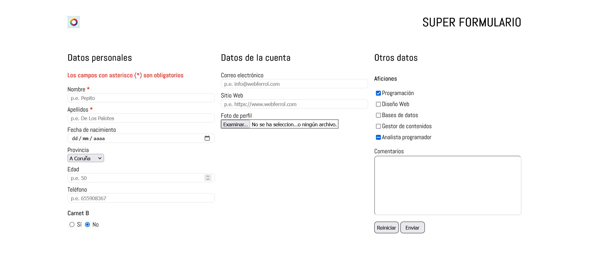

# Parte CSS del formulario

Intentar replicar la captura a partir de la siguiente imagen

También tienes la [versión móvil](./assets/screenshoot-mobil.png)

## Font

- Cargar la fuente Abel Regular de la carpeta fonts

## General

- Limpiar las listas (quitar rellenos, viñetas y enumeraciones)

## container

- Centrar el elemento en horizontal
- Máximo de anchura 1200px

## La cabecera (main-header)

- Utilizar __display: flex__
- Tamaño de la imagen de _2rem_

## La clase main-content

- Display también en flex